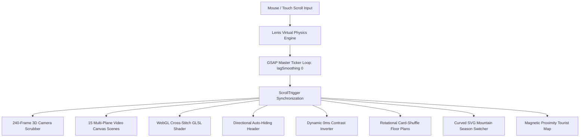

# 🏔️ Son Daven — Reverse Engineering & Creative Web Study

<div align="center">

[](https://vitejs.dev/)
[](https://greensock.com/)
[](https://lenis.darkroom.engineering/)
[](https://www.khronos.org/webgl/)
[](https://swiperjs.com/)
[](https://www.awwwards.com/)

**An educational, first-principles reverse-engineering master study of the award-winning luxury resort website [sondaven.com](https://sondaven.com/en).**

[Live Target](https://sondaven.com/en) • [Architecture Blueprint](./docs/SONDAVEN_ARCHITECTURE_DEEPDIVE.md) • [Knowledge Vault Notes](../../knowledge-vault/05-Sugoweb/)

---

</div>

## 🌟 Project Purpose

This project is an advanced, deep-dive architectural dissection and complete frontend rebuild of **Son Daven (Design Resort Hotel in Yaremche, Ukrainian Carpathians)**. 

Rather than blindly assembling boilerplate, this study breaks down every mathematical formula, GPU shader algorithm, inertial physics loop, and spatial transition that powers modern award-winning web design.



---

## 🔬 Core Engineering Innovations Dissected

### 1. 🏎️ Virtual Inertial Scrolling & Ticker Merging
* **The Problem:** Standard browser mousewheel events emit irregular, discrete delta spikes. Combining external smooth scrollers with GSAP often results in dual uncoordinated `requestAnimationFrame` loops, producing micro-stuttering on 120Hz/ProMotion displays.
* **The Solution:** Lenis is driven strictly inside `gsap.ticker.add((time) => lenis.raf(time * 1000))` with `gsap.ticker.lagSmoothing(0)` to force strict 1:1 mathematical alignment between scroll distance and pinned canvas timelines.

$$\text{decay}(t) = \min\left(1, 1.001 - 2^{-10t}\right)$$

---

### 2. 🎞️ 240-Frame 3D Camera Move Scrubber (Canvas 2D vs `<video>`)
* **The Problem:** Scrubbing `video.currentTime` forces the browser to decode temporal motion deltas (P/B-frames) backwards and forwards on the fly, creating 200–500ms seek latency.
* **The Solution:** 240 high-resolution WebP intra-frame bitmaps (120 daytime sunlight frames + 120 nighttime architectural lighting frames) preloaded into memory and drawn via `ctx.drawImage()` in $< 1\text{ms}$ on the GPU.
* **Aspect-Ratio Cover Formula:** Emulating `object-fit: cover` on `<canvas>` without stretching:

$$\text{scale} = \max\left(\frac{W_{\text{canvas}}}{W_{\text{img}}}, \frac{H_{\text{canvas}}}{H_{\text{img}}}\right), \quad X_{\text{offset}} = \frac{W_{\text{canvas}} - (W_{\text{img}} \times \text{scale})}{2}$$

---

### 3. 🧵 Real-Time WebGL Cross-Stitch & Dither Fragment Shader
* **The Problem:** Simulating Ukrainian Hutsul cross-stitch embroidery by manipulating CPU pixels with `ctx.getImageData()` processes $> 2,000,000$ pixels per frame, dropping performance below 15fps.
* **The Solution:** A custom WebGL GLSL fragment shader executing across thousands of parallel GPU cores:
  1. Snaps continuous UV texture coordinates into discrete embroidery grid cells: $\text{gridUV} = \frac{\lfloor \text{UV} \times \text{gridSize} \rfloor}{\text{gridSize}}$
  2. Samples luminance using the ITU-R BT.601 human perception formula: $L = 0.299R + 0.587G + 0.114B$
  3. Re-maps contrast black/white thresholds and paints surviving threads in metallic Carpathian bronze (`#a89474`).

---

### 4. 🎴 Rotational Card-Shuffle Spatial Transitions
* **The Problem:** Standard tab switchers (Studio $\rightarrow$ Deluxe $\rightarrow$ Penthouse) feel static and disconnected from physical architecture.
* **The Solution:** An angular spatial transform pivoted along the lower hinge (`transformOrigin: "top bottom"`):
  - **Outgoing Card:** Swings left with `xPercent: -125, rotate: 15, ease: 'power3.inOut'`
  - **Incoming Card:** Swings in from right: `from: { xPercent: 125, rotate: -15 } to { xPercent: 0, rotate: 0 }`
  - Integrated with nested Swiper.js touch photo galleries for each apartment category.

---

### 5. ⛰️ Curved SVG Mountain Season Switcher
* **The Problem:** Standard UI sliders are straight horizontal tracks that do not fit mountain elevation topographies.
* **The Solution:**
  1. **Arc-Length Parameterization:** Uses `path.getTotalLength()` and `path.getPointAtLength()` to ensure constant physical velocity along non-linear Bezier curves.
  2. **Euclidean Distance Projection:** Samples 100 equidistant steps along the curve to project any cursor coordinate $(x, y)$ onto the closest point on the mountain ridge.
  3. Seamlessly crossfades between Summer and Winter environmental video layers on drag release.

---

### 6. 🧲 Proximity-Sensitive Magnetic Tourist Map
* **The Problem:** Flat map markers feel lifeless.
* **The Solution:** An inverse-distance magnetic vector field:
  $$d = \sqrt{(x_{\text{cursor}} - x_{\text{pin}})^2 + (y_{\text{cursor}} - y_{\text{pin}})^2}$$
  When the cursor enters a $150\text{px}$ sphere of influence around landmarks (Dovbush Rocks, Probiy Waterfall), the badge magnetically translates toward the cursor and snaps back with a damped harmonic oscillation (`ease: 'elastic.out(1, 0.4)'`).

---

### 7. 🌗 0ms-Reflow Dynamic Contrast Theme Inverter
* **The Problem:** Fixed navigation headers, sound toggles, and modal buttons must invert colors seamlessly across dark charcoal (`#141414`) and light sand (`#eae4db`) sections.
* **The Solution:** Fixed elements observe section thresholds via `ScrollTrigger` and toggle root/element attributes (`[theme_on-dark]`, `[theme_on-light]`). CSS custom properties (`var(--theme-text)`) interpolate colors smoothly on the GPU with 0ms DOM reflow.

---

### 8. 🎵 Anti-Clicking Carpathian Folk Ambient Audio Engine
* **The Problem:** Abruptly starting/stopping audio creates an instant DC step discontinuity in the speaker cone, resulting in an audible "pop" or "click".
* **The Solution:** Volume is ramped smoothly using GSAP power curves ($0.0 \leftrightarrow 0.3$) over $0.8\text{s}$ before calling `audio.pause()`.

---

## 🛠️ Tech Stack & Dependencies

| Tool / Library | Version | Purpose |
| :--- | :--- | :--- |
| **Vite** | `^5.4.0` | Ultra-fast ES module bundler and dev server |
| **GSAP** | `^3.14.0` | ScrollTrigger, Flip, CustomEase, and Timeline animations |
| **Lenis** | `^1.3.15` | Virtual inertial smooth scroll physics engine |
| **WebGL (GLSL)** | Raw API | Hardware-accelerated dither and cross-stitch fragment shaders |
| **Swiper** | `^11.0.6` | Touch/drag infrastructure and apartment photo carousels |
| **Three.js** | `^0.160.0` | 3D rendering pipeline support |
| **Web Audio API** | Native | Anti-clicking gain ramp audio player |

---

## 📁 Repository Structure

```text
├── public/
│   └── assets/
│       ├── hero-video/          # 120 Daytime 3D camera move frames (000.webp - 119.webp)
│       ├── hero-video-dark/     # 120 Nighttime 3D camera move frames (000.webp - 119.webp)
│       ├── scenes/              # 15 Multi-plane wildlife & nature MP4 scene layers
│       ├── sondaven.min.css     # Production design system & Webflow layout grid
│       └── carpathian-whispers-hutsul-ambient.mp3
├── src/
│   ├── animations/
│   │   └── textReveal.js        # SplitText masked line and heading typography reveals
│   ├── components/
│   │   ├── apartmentsTabs.js    # Rotational card-shuffle apartment visualizer
│   │   ├── audioPlayer.js       # Anti-clicking Web Audio player with waveform
│   │   ├── benefitsSlider.js    # Swiper.js infrastructure carousel with progress line
│   │   ├── canvasScroller.js    # 120-frame hero canvas controller with cover math
│   │   ├── header.js            # Directional auto-hiding sticky navigation
│   │   ├── mapProximity.js      # Magnetic proximity attraction on map pins
│   │   ├── modalsAndAccordion.js# FAQ expanding accordion & fullscreen modals
│   │   ├── sceneCanvas.js       # 15 Headless video-to-canvas compositing scenes
│   │   └── seasonSlider.js      # Curved SVG slider with Euclidean projection
│   ├── core/
│   │   ├── preloader.js         # Cinematic 0-100% counter with sessionStorage bypass
│   │   ├── scroller.js          # Synchronized Lenis + GSAP ticker engine
│   │   ├── theme.js             # Dynamic contrast theme observer
│   │   └── webglEffect.js       # WebGL GLSL shader canvas pipeline
│   └── shaders/
│       └── ditherShader.js      # GLSL Vertex & Fragment shader sources
├── docs/                        # Architectural deep-dive & reverse-engineering notes
├── index.html                   # Complete 17-section semantic layout (388KB)
├── package.json
└── style.css                    # Custom CSS variables, tokens & animation utilities
```

---

## 🚀 Getting Started Locally

### Prerequisites
* **Node.js**: v18.0 or higher
* **npm** or **pnpm**

### Installation & Run
```bash
# 1. Clone the repository
git clone https://github.com/karnVen/karnVen_sondaven.git
cd karnVen_sondaven

# 2. Install dependencies
npm install

# 3. Start the interactive local development server
npm run dev
```

Visit `http://localhost:5173/` in your browser.

### Production Build & Validation
```bash
# Build the optimized production bundle
npm run build

# Preview the production build locally
npm run preview
```

---

## 📚 AI-bou Knowledge Vault Study Guides

This project is tied directly to the **AI-bou Knowledge Vault** using the **Alvar Method (Axioms $\rightarrow$ Motivated Discovery $\rightarrow$ Dependency Map $\rightarrow$ Code $\rightarrow$ Pitfalls)**:

* [**`01-inertial-scroll-and-ticker-sync.md`**](../../knowledge-vault/05-Sugoweb/01-inertial-scroll-and-ticker-sync.md) — Virtual scrolling, requestAnimationFrame merging, layout-shift prevention.
* [**`02-canvas-frame-scrubbing-and-webcodecs.md`**](../../knowledge-vault/05-Sugoweb/02-canvas-frame-scrubbing-and-webcodecs.md) — I-frames vs P/B-frames, WebCodecs, 2D canvas cover math.
* [**`03-webgl-shaders-and-dither-quantization.md`**](../../knowledge-vault/05-Sugoweb/03-webgl-shaders-and-dither-quantization.md) — GLSL fragment shaders, coordinate quantization, human eye luminance.
* [**`04-curved-svg-math-and-magnetic-proximity.md`**](../../knowledge-vault/05-Sugoweb/04-curved-svg-math-and-magnetic-proximity.md) — Arc-length parameterization, Euclidean projection, magnetic spring vectors.
* [**`05-dynamic-contrast-and-audio-engine.md`**](../../knowledge-vault/05-Sugoweb/05-dynamic-contrast-and-audio-engine.md) — 0ms CSS variable theme inverting, GainNode audio ramping.
* [**`07-multi-plane-canvas-and-swiper-mechanics.md`**](../../knowledge-vault/05-Sugoweb/07-multi-plane-canvas-and-swiper-mechanics.md) — Headless video canvas compositing, battery-saving intersection observers.
* [**`08-rotational-card-shuffle-and-modals.md`**](../../knowledge-vault/05-Sugoweb/08-rotational-card-shuffle-and-modals.md) — Rotational spatial card-shuffle transitions and fullscreen modal lifecycles.

---

## 📄 License & Attribution

This project is created strictly for **educational and research purposes** as part of the AI-bou advanced web development curriculum. 
All design concepts, trademarked names, and original assets belong to **Son Daven / Blago Urban Tech Developer**.

Designed with ❤️ for first-principles creative web development.
