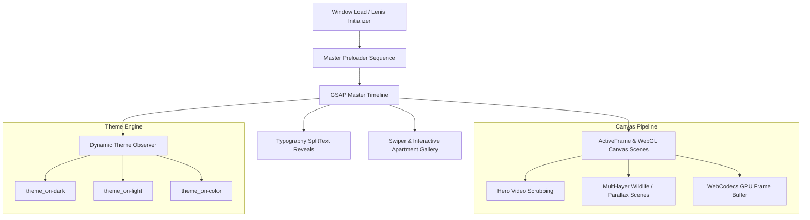

# Son Daven Architecture Deep-Dive & Engineering Blueprint
> **Educational Reverse-Engineering Study — AI-bou Learning System**  
> Target: [https://sondaven.com/en](https://sondaven.com/en)

---

## 1. Unconditional Truths (The Axioms)

1. **DOM Scroll Decoupling:** Native browser scrolling is non-deterministic across devices and refresh rates. To achieve synchronized 60fps/120fps video frame scrubbing and multi-layer parallax, scrolling must be virtualized and interpolated via an inertial physics engine (**Lenis** synced to **GSAP Ticker**).
2. **Video Scrubbing Bottlenecks:** Standard HTML5 `<video>` elements cannot seek smoothly on scroll without micro-stuttering due to keyframe (I-frame) decoding latency. The site solves this via two techniques:
   - **`ActiveFrame.js` + WebCodecs API:** Binary chunk streaming of intra-frame video buffers decoded directly to GPU canvas.
   - **Multi-layer Canvas Compositing:** Transparent HEVC/WebM alpha video clips composited over high-res AVIF backgrounds on 2D/WebGL canvas contexts.
3. **Reactive Inversion (Theme Engine):** Sticky and fixed UI chrome (header, navigation, ambient audio toggle, modal buttons) must observe background sections via `ScrollTrigger` / `IntersectionObserver` to dynamically toggle high-contrast CSS color variables without layout recalculation.

---

## 2. Motivated Discovery ("Why Does This Exist?")

### The Problem
Traditional luxury hospitality websites are static, slow, and feel like corporate brochures. They fail to convey atmosphere, landscape, and altitude. 

### The Solution: The "Awwwards Living Canvas" Paradigm
`sondaven.com` combines:
- **Atmospheric Audio Engineering:** Ambient Carpathian folk soundscape with low-pass filters and dynamic volume ramping.
- **Micro-Layered Depth:** Multi-plane canvas animations where trees, clouds, roaming sheep, and flying birds move at differential parallax rates based on user scroll velocity.
- **Cinematic Preloader & Session Persistence:** Pre-buffering assets on cold load with animated SVG logos and percentage tickers, while skipping effortlessly on subsequent page visits using `sessionStorage`.

---

## 3. Dependency Map

---

## 4. Full Tech Stack & Skills Required

### A. Skills You Must Master
| Skill | Why It's Needed |
| :--- | :--- |
| **GSAP (`ScrollTrigger`, `Flip`, `CustomEase`, `SplitText`)** | Complex synchronized scroll timelines, directional header reveals, and masked line-by-line typography reveals. |
| **Lenis (Inertial Physics Scrolling)** | Creating buttery-smooth momentum scrolling and syncing with GSAP's `requestAnimationFrame` loop. |
| **HTML5 Canvas & Video Compositing** | Drawing video frames, alpha masks, and layered scene animations with zero dropped frames. |
| **WebCodecs API & Binary Buffer Parsing** | Understanding how `ActiveFrame.js` decodes custom binary video containers without standard HTML5 seek lag. |
| **CSS Architecture & Custom Properties** | Building tokenized color systems that switch instantly via CSS variables on attribute change (`[theme_on-dark]`, `[theme_on-light]`). |
| **Web Audio API** | Managing ambient loops, gain nodes, smooth fade-in/out, and user gesture unlocking. |
| **Barba.js Single Page App (SPA) Transitions** | Seamless page-to-page morphing without full browser reloads. |

### B. Production Libraries Used
1. **Lenis (`v1.3.15`)** — Smooth scroll engine
2. **GSAP (`v3.13.0` + `v3.14.1`)** — Animation engine + ScrollTrigger, Flip, CustomEase, SplitText
3. **Swiper (`v11.0.6`)** — Touch/drag apartment and photo gallery carousels
4. **Barba.js (`@barba/core`)** — PJAX page transitions
5. **ActiveFrame.js** — Custom WebCodecs hardware-accelerated video frame decoder
6. **Webflow CSS Framework** — Responsive utility layout grid

---

## 5. Reverse-Engineered Core Modules

### 1. Directional Header Module (`initHeaderHide`)
* Calculates scroll delta and velocity.
* Slides up when scrolling down $> 100px$.
* Instantly slides back when scrolling up by $\ge 30px$.

### 2. Multi-Scene Canvas Engine (`initAllScenes`)
* Uses 15 distinct canvas scene targets:
  - Hero mountain scene (`data-intro-bg-scene`, `data-intro-over-scene`)
  - Wildlife & sheep sequences (`hero_sheeps-c.mp4`, `hero_tree-c.mp4`)
  - Cloud drift & seasonal shifts (`seasons_summer.mp4`, `seasons_winter.mp4`)
  - River and bird layers (`factoids_river-c.mp4`, `birds_04.hevc.mp4`)

### 3. Ambient Audio Engine (`initAudio`)
* Streams `carpathian-whispers-hutsul-ambient.mp3` with Web Audio GainNode.
* Floating UI button with animated waveform bar visualization.
* Remembers mute/unmute state in `localStorage`.

---

## 6. Key Takeaways & Common Pitfalls

> [!IMPORTANT]
> **1. Don't use raw `<video>` for scroll scrub:** Native video decoding buffers causes severe stuttering on Safari and mobile. Always use canvas frame scrubbing or WebCodecs.
> 
> **2. Sync Lenis to GSAP Ticker:** Never run two separate `requestAnimationFrame` loops for scroll and animation. Hook Lenis directly into `gsap.ticker.add((time) => lenis.raf(time * 1000))`.
> 
> **3. Theme Inversion via CSS Variables:** Do not animate individual color properties in JavaScript. Toggle class/attribute on parent and let CSS transitions handle RGB interpolations smoothly on the GPU.
